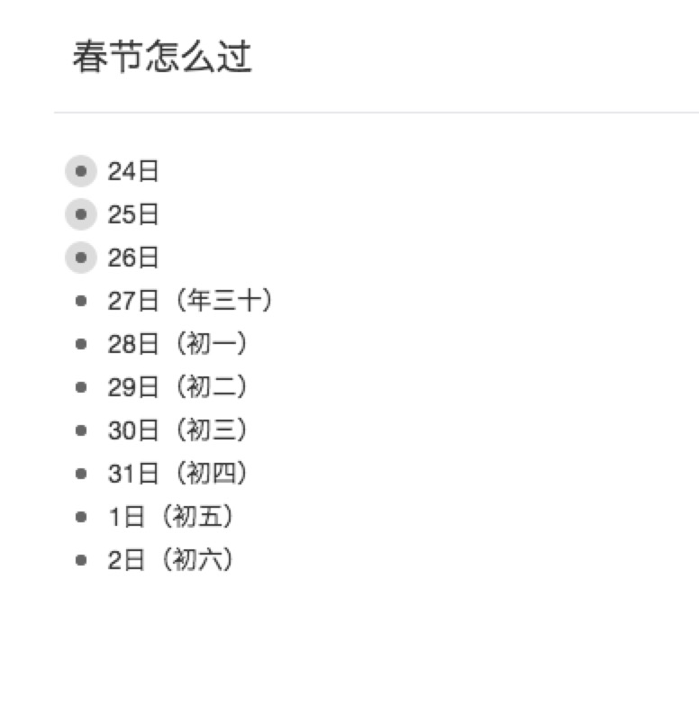
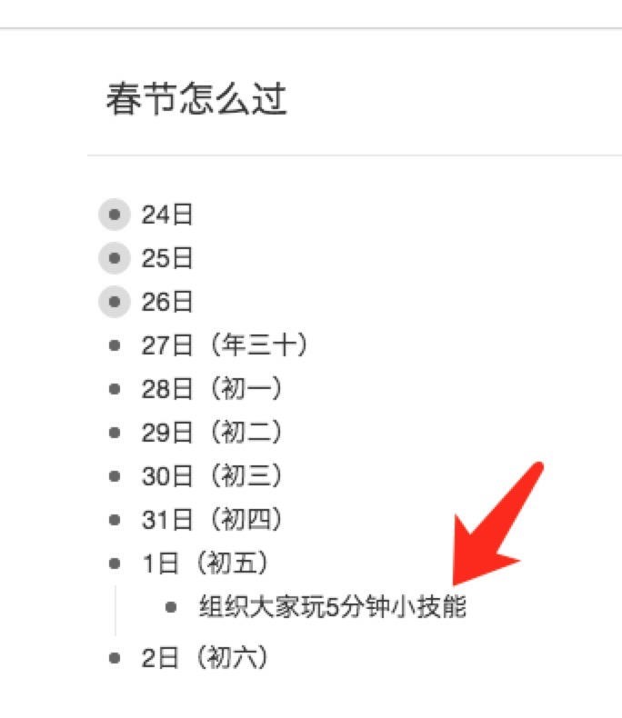
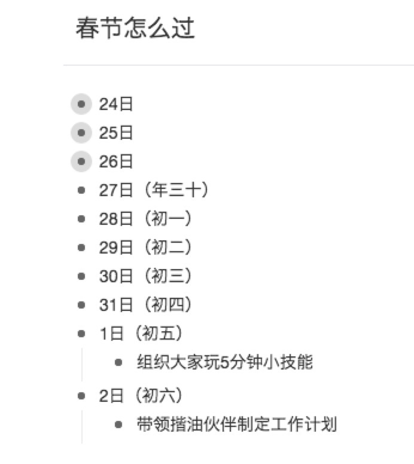

## DAY.12
+ **关键词：**假期补坑、知识管理、价值
+ **主要事件：**
    + 永澄老师关于假期补坑安排的分享
    + 永澄老师送出关于知识管理的大礼
    + 五福开奖的讨论与红包雨
    + 大大文章写啥的讨论—父亲
+ **主要语录**

**【永澄老师分享】**
为了帮助你更好地过好春节假期，请准备以下的物品。
是的，我知道你现在正在收拾家、正在准备买东西、正在看电视……

但是，请拿出15分钟的时间就足够了。我可以用15分钟的时间提升大家的春节收获~~

**Step1 ：对我们所处的外部环境要有基本认知。**

接下来我们要面对的是7天长假，分别是：
1.27（三十）：
1.28（初一）：
1.29（初二）：
1.30（初三）：
1.31（初四）：
2.1（初五）：
2.2（初六）：

你试试看，如果你不列下来，很有可能你都不知道初一是几号、是星期几。

第一步到这里就结束了，一会再用到，接下来我们进入第二步，分析动机和需求。

**Step2 ：分析动机和需求**

当我们遇到放假的时候，动机会和平时不同，更多会希望有一些休息，如果没有满足内在动机的要求，那你的大象会很不满意的，并且它会一直拖着你不让你变好的方式来惩罚你

通常来说，我们要分析感性动机和理性动机两种，分别为：

- 感性动机
- 理性动机
	- 解决问题的需求
	- 考虑发展的需求

我们一个个来分析，首先来看感性需求。

请你安安静静坐着，然后问问自己：如果说放假了，我最想最想要的是什么？这个想法可能深深地躲在心底。

我不知道你是怎么想的，我的想法有以下内容：

- 好好休息，随便睡到自然醒
- 把没有看过的电视剧都看完
- 可以随便地玩游戏
- 陪孩子出去玩，和她过她的第一个信念
- 和汪隽子找个城市随便逛逛
你一定要把所有的内容都罗列出来，一定要这样，因为如果你不满足它的需求，它未来就会让你不爽~

当你都写下来之后，你会有这样的一个感受：如果不去思考它，它很有可能会成为一个底层的进程，一直在你的内心消耗你的能量，让你想玩不能玩，想休息不能休息，明明应该享受的时间，却用来消耗了，你有没有过类似的感受？

好了，我们接下来再看看你对过往补坑的需求，也就是说：放假前因为忙碌，你有很多已经承诺的事情，但是没有完成，趁着这个时候有空了，你希望补全什么呢？

我想了想我的，我的补坑的需求有：

- 给CEO的学员打电话
- 安排揩油伙伴2月份的活动
- 把在行的15个约见给见了
- 5个小伙伴的咨询案例
- 分答要好好维护

记着：我现在一边给大家打字，一边正在思考我自己的内容。
所以，你有充足的时间来思考，你一定要把自己想要的写下来，只有写下来，才可能实现。
老妈子附身：只有写下来，才有可能实现！！！重要的事情，打叹号
只有写下来，才有可能实现！！！
好了，接下来，问问自己发展的需求有什么。也就是说，你在这几天要做什么事情，来让七天后的自己更好地开始新的旅程？

关于发展的需求，请务必记着，在初五那天安排一个必做任务！

这个必做就是：给自己设置一个5分钟可以学会的技能。

这是我的神器，我很少告诉别人，这次送出来给大家（你要是觉得有用，记得最后的时候给我打红包~）。初五必须要学一个小技能。

因为它可以给你带来“首胜”状态，帮助你在初六的时候规划接下来发展！到时候，初五那天，我组织大家一起玩这个好吧~

好了，接下来安排一下任务吧：

- 书写心理表征的书籍
- 易仁永澄后宫团规划和建设
- 持续日更
- 思维模型构建推进
- 安排全年学习规划
- 形成自我管理新模式
- CEO课程的准备和投放
- 返修社个人宪法的制定
- 领读成甲老师的书籍
- 完成年前新入书籍的检视阅读

到此，第二步就都完成了。

注意，这一步的名字叫做【罗列任务】，这些任务并不是计划，只有把任务安排好优先级、拍好先后顺序才叫计划。

在形成计划之前，你要整体感知一下，你内心的真实想法、你补坑的需求、你发展的期待，这三摊事情放在一起，7天的时间够不够？你可以给自己打个分，如果时间一定够就打10分，如果不够就打0分，你会打几分？

我给自己打了3分，虽然我心有不甘，但是我真的完成不了。
这个时候就是心智发挥作用的地方了。

有的人明知道时间不够，还要给自己安排超量的任务，然后让自己郁闷。
明智的人明知道7天时间不够，但是他知道自己还有更多的时间，不内耗才是关键，于是他就会【推迟自己的满足感】，安排任务的先后顺序，给自己留足冗余，扎实地往前走。

一口不能吃成胖子，一天不能减成瘦子。
心智就是这样！

**Step3 ：把任务安排在每一天**

第三步就是给自己安排任务啦。
这里我必须要提醒你的是：很多人认为自己放假的效率和工作时是一样的，那一定是扯淡的！

休息时候的创造效率不足原来的2成，也就是你原来每天能工作8小时，现在大约也就是1.5-2小时。

一定一定给自己留足空间。
对了，忘记说了，初六那天一定要给自己留出2个小时来制定后续的规划。否则，你上班之后会遇到一个非常可怕的情况：上班了很久，但是却感觉一直没有心力，然后拖了两个周都恢复不了。

很多人会不好意思地说：“诶，我一月份的目标都没有达成呢，不知道该怎么办？”

我给你说，1月份过年的话，很多人就是不可能实现自己一月份的目标的，这是重灾区。
对于你来说，现在根本不是实现目标的事情，而是问问自己：是什么让自己没有实现目标。
愚蠢的人只会反复问自己为什么不能实现目标，聪明人才真正去寻找原因，并在因上努力去改正。

好了，请去安排你的任务吧，把任务写入到七天的时间里。
重要级排布：
三十——初四，重点放在内心放假的需求上
初四——出六，重点放在发展的需求上

-----------

**【永澄老师关于知识管理的分享】**
过年了，我也想送份礼给大家。但是不知道送点什么好。

我们过年基本上是从晚上五点半开始，还有这么一会时间，干点啥吧？

我呢，这会就在思考问题，关于知识管理的，那我就给大家随便聊聊吧~权当送礼出去。

**核心思路描述**：

核心目的是：价值创造、价值交换、价值转化
手段很有多，知识管理就是其中的一个。

那么，如果将自己的电脑和手机设置成和自己的价值变化极具相关性呢？如何将自己的知识管理体系和价值变化极具性关系那个呢？

所以，核心目的就出来了。

但是呢，由于每个人的定位不一样，有的刚工作三五年的小伙伴，最重要的定位是考虑如何做好价值积累的问题。有的人的特点是将价值在不同资源中交换，有的人的恰好遇到了价值变现的时候。

我们站在一个运营的角度来看，任何一个目的都是需要有手段对应支撑的，比如吃饭，你就需要筷子勺子。

如果你略微研究过精细化运营，就明白流程化的意义，任何一个重要的业务都需要形成流程，比如说把大象放到冰箱，就需要：
1. 打开冰箱门
2. 放入大象
3. 关闭并项目
所以，请记住核心理念：【**任何一个目的都需要一个业务流程来支撑**】

既然这个理念已经出来了，那接下来的关键就是要根据你现在所处的状态来判断你的业务流程：
1. 如果你在价值积累阶段，那么你的业务流程是什么？
2. 如果你在价值变现阶段，你的业务流程是什么？

或者你同时处于不同的阶段，但是你都应该有自己的业务流程。

我见过无数人搞知识管理，略有复杂一点的问题就是：我如果想要建立自己的知识体系怎么办？那我就想问问你，建立知识体系究竟是手段还是目的，如果是手段，那么目的是什么呢？
可是，不见得有人能够回答这个问题。
那么知识管理的效率也将会降低。

现在明白了，**知识管理的目的是为了价值考虑的，价值积累、交换、变化等**。

接下来，我们看看每个流程到底是怎么构成的。
那让我们看看价值积累吧。

你的价值是怎么积累的呢？

我的方式大约是三步：

**输入-重构-输出**

注意，上面的这个叫做思路，如果你不懂什么是思路，请见：http://mp.weixin.qq.com/s?__biz=MzIzOTY0OTA3OA==&mid=2247483876&idx=1&sn=c44e0ece92fbdc05b6aa684042957236&chksm=e927a9bdde5020ab05856aff0ea323c1e5230314e1e02a772ca6302403e855bc0084cb346cd7#rd

分别来看，输入怎么做？

**输入关注的问题是：输入源**。我有几个方案**：读万卷书、行万里路、高手指路、自己百度**。

####来看读书。

读书我的有以下的分类方式：

1. 读纸质书
有若干种方法，最常见的有：检视阅读、分析阅读、心理表征导向型阅读法、主题阅读四种。

2. 读电子书
只是为了消遣、了解点信息，通常是小说和文章，用kindle推送的方式实现。

####第二个是行万里路，本质上是做。

做是成长的核心，没有做事情就不可能有成长。而做事情又分为三个核心关键点：**做前学、做中学、做后学。**

做前学采用的是项目管理串联知识体系复用，来通过了解前人的经验，来帮助自己快速掌握相关知识能力。

做中学采用的方式是元认知学习法，我经常起名字叫分身学习法。就在在同一个时间内部仅仅学习做法，还要学习做法背后模式的套路、思路，而后者才最重要，最关键，最体现效率的部分

做后学是回顾、总结、复盘方法，成甲老师也提出了相关的方式。

####第三个是高手指路。

这点其实根本就不是知识管理的问题。是两个部分：价值管理 + 人脉管理。但是很难讲人脉管理是不是归属在知识管理中。

作为勾搭高手的方式，我也写过多次了：
1. 你必须自己有价值，否则别勾搭，还惹人烦
2. 你必须要【先】考虑能为别人做点什么，再去求人
3. 你必须梳理好问题的背景信息描述，尽可能别耽误时间
4. 如果你勾搭无数高手，请记得付费；如果你只跟一个人，那就死跟到底，钱到不见得花了。别又不想花钱、又不想花时间，高手面前别作，一眼看穿。

人脉和价值两者结合在一起就是一句话：努力成为价值交换网络的节点。
由于这个部分更涉及到输出端，所以，在输出的部分详细说吧

####最后就是自己百度

我觉得这个就是网络检索能力，这是最基本的能力，如果你这个都不会，那就别磨磨唧唧了，赶紧在学堂在线或者Mooc上报一个检索课程学习下吧？

就好像你不会走路，然后怪别人不等你，那就是笑话了。

输入源部分已经说完了，但是关于输入还是要交流一下能力相关问题。

输入源中有几个能力，必须要说一下：

1. **稳抓目的的能力**。很多人在输入的时候仿佛被施加了魔法一样，整个人变成了跳跳糖，只要有一点水，这个人就蹦跶起来。啥意思呢，很多人，在学习的时候，内心不静，遇到一个相关性的内容，立刻整个人就跟着跑了。经常是几个小时过去了，但是都不知道自己要做什么了
2. **批判式思维的能力**。这个能力可以帮助你从互联网营销中解放出来。你要知道，我是一个非常非常非常不喜欢营销，甚至是极度厌恶营销的人，可是这个环境太差了，你不营销，客户就不跟你玩了。所以，连我都会使用夸张、危言耸听、唯一机会、损失厌恶等手段来抓住用户，更何况其他人。没有批判式思维能力的训练，基本上就是个陀螺，别人怎么打你你怎么转。
3. **找到关键词的能力**。这是体现效能的关键能力了。很多人对于关键词捕捉的能力非常差，你就会发现这样的人会出现两个问题：别人说了什么他听不明白，另外他也无法表达自己的观点。这就是需要训练的地方，我有个训练方法就是构建自己的wiki库，我给很多人说过了，只是，很多人会问我：老师，什么叫wiki？我就懒得继续说了，我都说到这里了，你不知道去查查百度么？既然很多人都不懂wiki，你如果懂了，你不就个体崛起了么？
4. 再多说一句，捕捉关键词的能力，是实现心理表征学习法的核心能力。

其他更多的能力不说了，超过3个，人的认知就无法接受过来了。我们重新回顾一下这三个：
通过明确目的，知道自己做事情都是和价值积累有关的，如果你脱离了这个目的，自己就会焦虑并会产生内疚情绪。等明确目的之后，就要抓到关键词，而关键词要使用批判性思维的方式找出来。
慢慢练，别看一个输入，得需要3-5年的训练。因此我建议小白先干掉200本书的阅读，后面你就等着飞吧。

**接下来就是工具问题**

任何一个课程，你去听完了之后发现这个老师都不给你谈工具问题，你就可以直接走了！没有工具的学习叫教育，不是培训，如果你选择教育你投入的代价就不是免费课程了，而是各种门槛、筛选、学费……如果你参加的是培训，那就必须得到工具

所以，接下来看看我们都需要什么工具来做好知识输入。

我先说说原则，我的原则极为简单，那就是：**简单**。

一个工具不能足够简单，在当今这个时代就不值得拥有。先给你看看我原来的环境：

一台windows、一个iphone、一个ipad、一个macbook pro、一个imac。你会发现我遇到了很大的问题，那就是双平台，在这其中选择工具真的很麻烦，经常遇到了不匹配的情况。

所以，我当机立断，跟自己说坚决不用windows做输入了（目前的输出偶尔还用一下），现在你看到我的所有体系都是基于Mac的。

这里我还要给你个故事：

1. 我在工资卡里只有7000+的时候，我就去买了第一个macbook air，因为我很想了解苹果生态下的工具效能。
2. 虽然特别贵特别贵，但是我还是咬牙买了，后来，我就讲mac的使用，都赚回来了3万多元钱！
3. 我的核心理念：你必须把自己的生产工具更新到最好的状态！

诶，很多人都不知道自己要生产什么……

所以，很多人问过我到底怎么使用笔记软件啊？昨天鲜鲜老师还问我这个问题。

我的答案是：我只用备忘录。

mac的备忘录有个好处，我在任何一个设备上的备忘录中输入内容，所有设备立刻瞬间同步。要知道，体验经济时代，你还要为打开印象笔记而多等13秒、为其他笔记复杂的目录结构而苦恼不以的时候，我早就去往备忘录了！

给你看看我的备忘录的结构，在我写这段内容的时候，我的备忘录中已经形成了一段全新的内容了。
（图片打不开了，呜呜呜~）

看看吧，各位，我的微信、电话、短信，全部都让它不要出现，我最关注的就是通往目标的过程中，知识输入输出问题、行动如何高效推进的问题。

所以，我的输入端的核心软件只有1种：

**备忘录**

但是为了更好地输入信息，我还有其他的软件：
1. **声之梦**，把文字转成语音，我一分钟可以听315个字的速度。
2. **印象笔记**，那些来不及看的东西保存到印象笔记，这里很容易导入到声之梦，我很满意
3. **变速MP3**，必备啊！必备啊！我通常用2-3倍速听东西，45分钟的课程，一个上班的路上就都听完了！

**好了，软件说完了，再说一下硬件吧。**

1. Mac生态就不说了，每一款最新的我必然第一时间更换了。
2. Bose QC30，耳机，什么都不耽误

没啦~~

好了，关于个人成长的三大核心：价值积累、价值交换、价值转化中第一部分价值积累的第一部分输入，已经完成了。

+ **一点思考**

啊啊啊啊啊，这个分享我怎么一点都不知道啊！！！还是在多群转播的，现在图片都过期啦，错失了一个亿！
